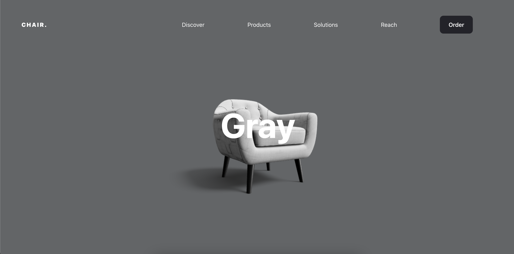

# R3F POC
### [Live Site](#)



## Introduction
This is a code repository proof of concept on using react three fiber to display 3d model. 

Setup:
- run ```yarn && yarn start``` 

Build: 
- run ```yarn build```
